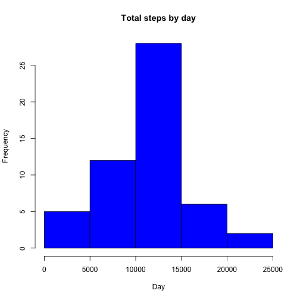
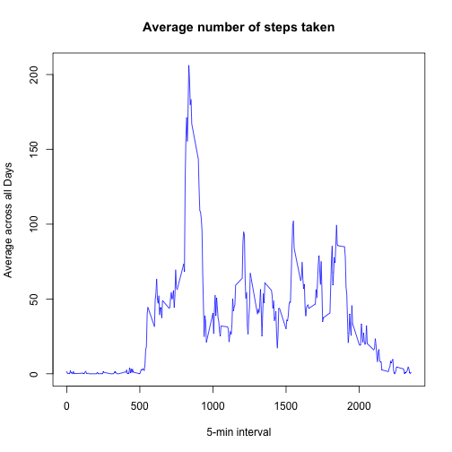
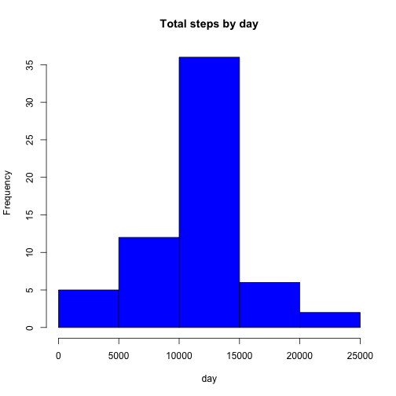
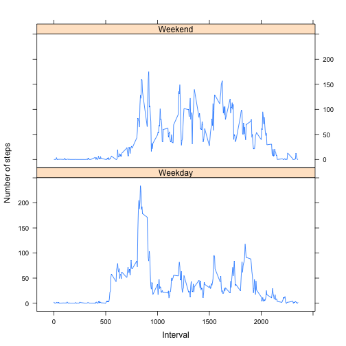

Setting - set echo = TRUE to allow codes to be visible 

```r
echo = TRUE 
```

##Loading and preprocessing the data
1. Load the data
2. Process/transform the data (if necessary) into a format suitable for your analysis


```r
dataset <- read.csv("activity.csv", colClasses = c("numeric", "character", 
    "numeric"))
```

```
## Warning: cannot open file 'activity.csv': No such file or directory
```

```
## Error: cannot open the connection
```

```r
library(lattice)
dataset$date <- as.Date(dataset$date, "%Y-%m-%d")
```

##What is mean total number of steps taken per day?
For this part of the assignment, you can ignore the missing values in the dataset.

1. Make a histogram of the total number of steps taken each day
2. Calculate and report the mean and median total number of steps taken per day


```r
totStepsTaken <- aggregate(steps ~ date, data = dataset, sum, na.rm = TRUE)
hist(totStepsTaken$steps, main = "Total steps by day", xlab = "Day", col = "blue")
```

 

Mean of the total number of steps taken per day

```r
mean(totStepsTaken$steps)
```

```
## [1] 10766
```

Median of the total number of steps taken per day 

```r
median(totStepsTaken$steps)
```

```
## [1] 10765
```


##What is the average daily activity pattern?
1.Make a time series plot (i.e. type = "l") of the 5-minute interval (x-axis) and the average number of steps taken, averaged across all days (y-axis)


```r
timeSeries <- tapply(dataset$steps, dataset$interval, mean, na.rm = TRUE)
plot(row.names(timeSeries), timeSeries, type = "l", xlab = "5-min interval", 
    ylab = "Average across all Days", main = "Average number of steps taken", 
    col = "blue")
```

 

2.Which 5-minute interval, on average across all the days in the dataset, contains the maximum number of steps?


```r
max_interval <- which.max(timeSeries)
names(max_interval)
```

```
## [1] "835"
```


##Imputing missing values
1. Calculate and report the total number of missing values in the dataset (i.e. the total number of rows with NAs)


```r
dataset_NA <- sum(is.na(dataset))
dataset_NA
```

```
## [1] 2304
```

2. Devise a strategy for filling in all of the missing values in the dataset. The strategy does not need to be sophisticated. For example, you could use the mean/median for that day, or the mean for that 5-minute interval, etc.


```r
StepsAverage <- aggregate(steps ~ interval, data = dataset, FUN = mean)
fillNA <- numeric()
for (i in 1:nrow(dataset)) {
    obs <- dataset[i, ]
    if (is.na(obs$steps)) {
        steps <- subset(StepsAverage, interval == obs$interval)$steps
    } else {
        steps <- obs$steps
    }
    fillNA <- c(fillNA, steps)
}
```
3. Create a new dataset that is equal to the original dataset but with the missing data filled in.


```r
newDataset <- dataset
newDataset$steps <- fillNA
```

4. Make a histogram of the total number of steps taken each day and Calculate and report the mean and median total number of steps taken per day. Do these values differ from the estimates from the first part of the assignment? What is the impact of imputing missing data on the estimates of the total daily number of steps?

```r
totSteps2 <- aggregate(steps ~ date, data = newDataset, sum, na.rm = TRUE)
hist(totSteps2$steps, main = "Total steps by day", xlab = "day", col = "blue")
```

 

Mean of the totoal number of steps taken per day: 

```r
mean(totSteps2$steps)
```

```
## [1] 10766
```

Median of the the total number of steps taken per day:

```r
median(totSteps2$steps)
```

```
## [1] 10766
```

The mean remains the same while there is a slight difference in the median where the new median is greater than the old median. 


##Are there differences in activity patterns between weekdays and weekends?
For this part the weekdays() function may be of some help here. Use the dataset with the filled-in missing values for this part.

1. Create a new factor variable in the dataset with two levels ??? ???weekday??? and ???weekend??? indicating whether a given date is a weekday or weekend day.


```r
day <- weekdays(dataset$date)
daylevel <- vector()
for (i in 1:nrow(dataset)) {
    if (day[i] == "Saturday") {
        daylevel[i] <- "Weekend"
    } else if (day[i] == "Sunday") {
        daylevel[i] <- "Weekend"
    } else {
        daylevel[i] <- "Weekday"
    }
}
dataset$daylevel <- daylevel
dataset$daylevel <- factor(dataset$daylevel)

stepsByDay <- aggregate(steps ~ interval + daylevel, data = dataset, mean)
names(stepsByDay) <- c("interval", "daylevel", "steps")
```

2. Make a panel plot containing a time series plot (i.e. type = "l") of the 5-minute interval (x-axis) and the average number of steps taken, averaged across all weekday days or weekend days (y-axis). See the README file in the GitHub repository to see an example of what this plot should look like using simulated data.

```r
xyplot(steps ~ interval | daylevel, stepsByDay, type = "l", layout = c(1, 2), 
    xlab = "Interval", ylab = "Number of steps")
```

 


